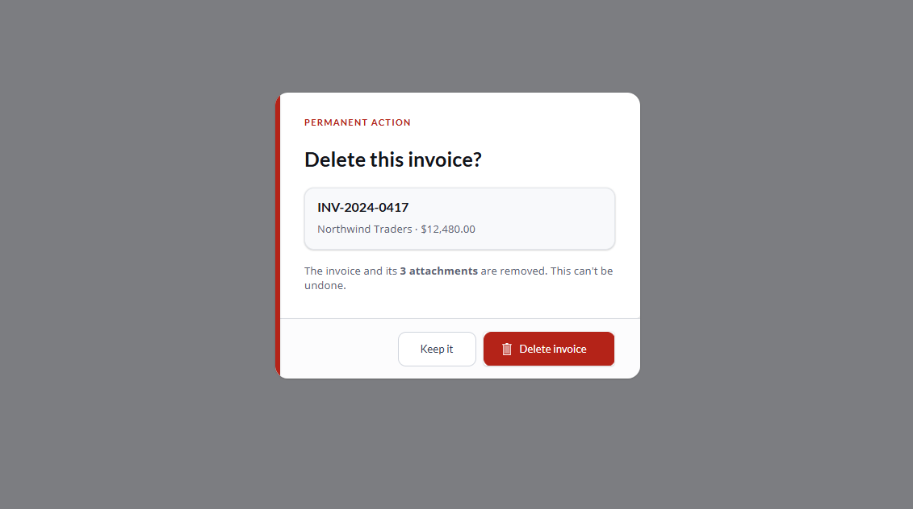

# Delete Confirmation Dialog for Power Apps

A reusable, themeable confirmation dialog for Canvas apps.

Import it, wire it up in a few minutes, and stop rebuilding the same dialog on
every screen.



---

## Why

Every Canvas app has a delete somewhere, and most of them have a confirmation
dialog that was rebuilt from scratch on each screen. This is that dialog, built
once.

It has **no output properties**. The consumer never asks the dialog what the
user picked — the dialog raises `OnConfirm` or `OnCancel` and the parent
responds. That's what makes the same instance safe to reuse against any table,
with no global variable tracking which button was pressed.

---

## Install

1. Download `DialogComponentLibrary_1_0_0_2.zip` from [Releases](../../releases).
2. **make.powerapps.com → Solutions → Import solution** → select the zip →
   **Import**.
3. Open the app where you want to use it.
4. **Insert → Get more components → Library components →** check
   `cmpConfirmDelete` → **Add**.

The component ships inside a library called **Canvas Dialogs**, which is what
you'll see in the Power Apps solution and component list.

---

## Quick start

**1. Drop `cmpConfirmDelete` on the screen.**

It sizes itself to fill the whole screen, so there's no position or dimension to
set. The scrim needs that full coverage.

**2. Initialize the variable that controls it, on `Screen.OnVisible`:**

```powerfx
Set(varConfirmOpen, false)
```

**3. Set `Visible` on the instance:**

```powerfx
Visible = varConfirmOpen
```

> **`Visible` is required.** Because the component fills the screen, the instance
> sits on top of everything and swallows every click until you hide it — even
> when `IsOpen` is false and nothing is drawn. If your buttons and galleries stop
> responding after you add the dialog, this is why.

**4. Set the content and wire the events:**

```powerfx
IsOpen         = varConfirmOpen
Title          = "Delete this invoice?"
Subtitle       = varTarget.InvoiceNumber
SubtitleDetail = varTarget.Customer
MessageHTML    = "This can't be undone."

OnConfirm      = Remove(Invoices, varTarget); Set(varConfirmOpen, false)
OnCancel       = Set(varConfirmOpen, false)
```

And on the trash icon in your gallery row:

```powerfx
OnSelect = Set(varTarget, ThisItem); Set(varConfirmOpen, true)
```

That's the whole integration.

---

## With a busy state

Disables both buttons and strikes through the record name while the delete is in
flight.

Initialize both variables on `Screen.OnVisible` first:

```powerfx
Set(varConfirmOpen, false); Set(varDeleting, false)
```

Then on the instance:

```powerfx
Visible        = varConfirmOpen
IsOpen         = varConfirmOpen
IsBusy         = varDeleting
Title          = "Delete this invoice?"
Subtitle       = varTarget.InvoiceNumber
SubtitleDetail = varTarget.Customer & " · " & Text(varTarget.Amount, "[$-en-US]$#,###.00")
MessageHTML    = "The invoice and its <strong>" & CountRows(varTarget.Attachments) &
                 " attachments</strong> are removed. This can't be undone."

OnConfirm      = Set(varDeleting, true);
                 Remove(Invoices, varTarget);
                 Set(varDeleting, false);
                 Set(varConfirmOpen, false);
                 Notify("Invoice deleted", NotificationType.Success)

OnCancel       = Set(varConfirmOpen, false)
```

---

## Properties

### Content

| Property | Type | Default | Notes |
|---|---|---|---|
| `Eyebrow` | Text | `"Permanent action"` | Small tracked label above the title. Blank hides it. |
| `Title` | Text | `"Delete this invoice?"` | |
| `Subtitle` | Text | `"INV-2024-0417"` | Record identifier, shown in the panel. |
| `SubtitleDetail` | Text | — | Secondary line under the subtitle. |
| `MessageHTML` | Text | — | Accepts HTML. `<strong>`, `<em>`, `<br>` all work. |
| `ConfirmLabel` | Text | `"Delete"` | |
| `CancelLabel` | Text | `"Cancel"` | |
| `BusyLabel` | Text | `"Deleting"` | Replaces `ConfirmLabel` while `IsBusy` is true. |

### State

| Property | Type | Default | Notes |
|---|---|---|---|
| `IsOpen` | Boolean | `false` | Show or hide the dialog. |
| `IsBusy` | Boolean | `false` | Disables both buttons, strikes through the subtitle. |
| `ShowRecordPanel` | Boolean | `true` | Set false for a plain title-and-message dialog. |

### Events

| Property | Fires when |
|---|---|
| `OnConfirm` | The confirm button is pressed. |
| `OnCancel` | The cancel button or the scrim. |

### Colors

| Property | Default |
|---|---|
| `AccentColor` | `RGBA(180, 35, 24, 1)` |
| `CardFill` | `RGBA(255, 255, 255, 1)` |
| `TitleColor` | `RGBA(18, 20, 26, 1)` |
| `BodyColor` | `RGBA(90, 98, 114, 1)` |
| `PanelFill` | `RGBA(248, 249, 251, 1)` |
| `PanelBorder` | `RGBA(228, 231, 236, 1)` |
| `FooterFill` | `RGBA(252, 252, 253, 1)` |
| `ScrimColor` | `RGBA(16, 19, 26, 0.55)` |
| `ConfirmFill` | `RGBA(180, 35, 24, 1)` |
| `ConfirmTextColor` | `RGBA(255, 255, 255, 1)` |
| `ConfirmHoverFill` | `RGBA(143, 27, 18, 1)` |
| `CancelFill` | `RGBA(255, 255, 255, 1)` |
| `CancelTextColor` | `RGBA(52, 64, 84, 1)` |
| `CancelBorder` | `RGBA(208, 213, 221, 1)` |
| `CancelHoverFill` | `RGBA(242, 244, 247, 1)` |

### Sizing

| Property | Default | Notes |
|---|---|---|
| `DialogWidth` | `452` | Card shrinks on narrow screens regardless. |
| `CardRadius` | `16` | |
| `ControlRadius` | `10` | Buttons and the record panel. |
| `RailWidth` | `4` | Accent stripe down the left edge. Set 0 to remove. |
| `ConfirmMinWidth` | `140` | Floor for the confirm button. |
| `CancelMinWidth` | `96` | Floor for the cancel button. |

---

## Theming

Point the color properties at whatever your app already uses:

```powerfx
AccentColor      = ThemeRec.Accent
ConfirmFill      = ThemeRec.Accent
ConfirmHoverFill = ThemeRec.AccentDark
```

If your brand is fixed and you'd rather nobody could change it, edit the
component and hard code the fills instead. You trade flexibility for
consistency, which is a perfectly good decision.

---

## Good to know

- The instance must sit **below** other controls in the tree, or they render on
  top of the scrim.
- `MessageHTML` takes HTML, so counts and record names can be bolded inline
  without the component knowing anything about your data.
- One instance per screen, not one per row. Set a variable to the target record
  before opening it.
- The confirm and cancel buttons size to their labels, with `ConfirmMinWidth`
  and `CancelMinWidth` as floors. Matched widths usually read better than tightly
  fitted ones, so lower both floors together if you lower them at all.

---

## Built with

Auto-layout containers throughout. `ManualLayout` appears in three places only,
all of them genuine overlaps: the card over the scrim, the accent rail over the
card body, and the trash icon over the confirm button.

---

## License

MIT. Use it, fork it, ship it in client work.
